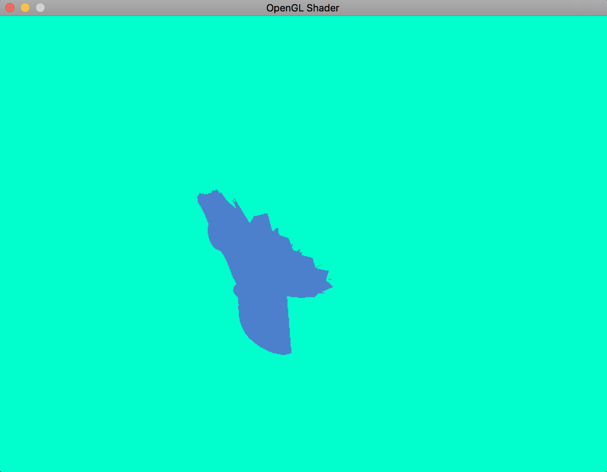

# goengine
golang voxel engine

The goal here is to create a graphics engine in the style of minecraft, with total control of terrain generation. For starters the goal currently is not to have destructible terrain. It should be usable as a basis for participation in GameJams.
Along the way I want to learn:
1. Mesh generation/handling/modification
2. Terrain generation
3. FPS & 3rd person camera
4. ...
5. ...
6. networking support for multiplayer

## How to contribute

- Fork the project, add your code & create a pull request.
- Create an [issue](https://github.com/tehcyx/goengine/issues)

## What does it look like


# Immediate next tasks

- [X] Meshing
- [X] OBJ loader
- [X] Figure out why the drawing is not working from the Mesh
- [ ] Change to my window code
- [ ] Use mouse to rotate camera eventually?
- [ ] Test if windows binary is still working
- [ ] MagicaVoxel imports

Look into this: https://github.com/raedatoui/learn-opengl-golang

### Pre requisites

...

## Compile & run

1. Install [Homebrew](https://brew.sh/)
2. Install go dependencies

    ```
    go get github.com/go-gl/gl/v4.1-core/gl
    go get github.com/go-gl/mathgl/mgl32
    go get -v github.com/veandco/go-sdl2/{sdl,mix,img,ttf}
    ```
3. Install SDL2 via brew: `brew install sdl2{,_image,_ttf,_mixer} pkg-config`
4. run `make`
5. run `./bin/app`

## Cross compile MacOs to Windows

...

## Cross compile MacOs to Linux

...